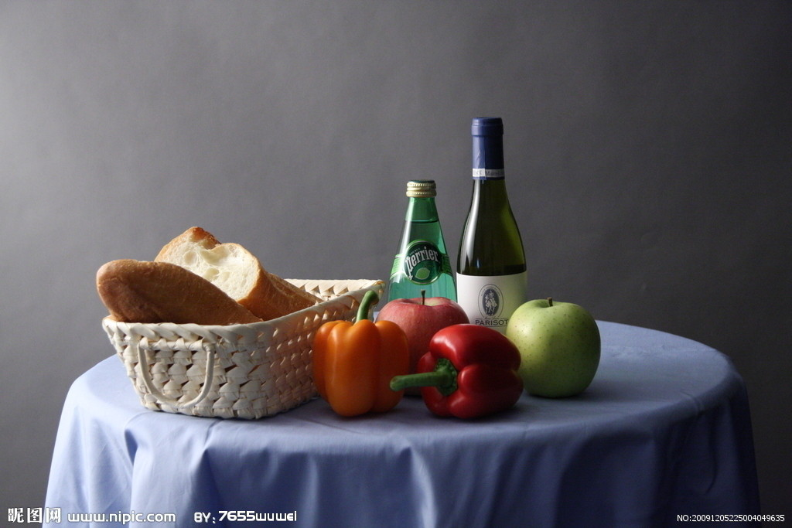
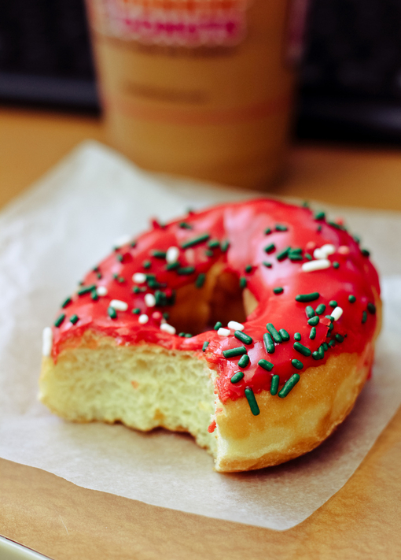
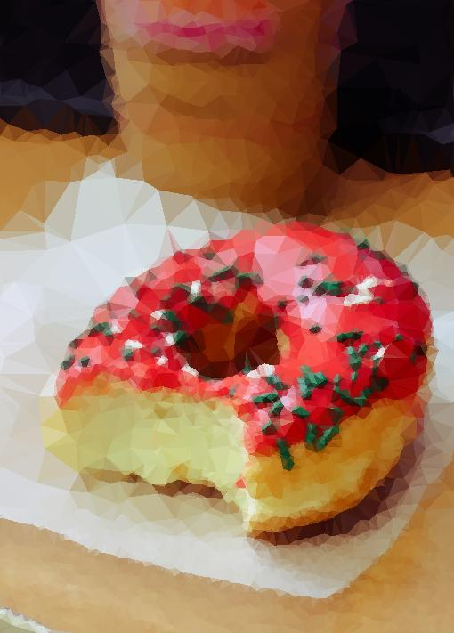
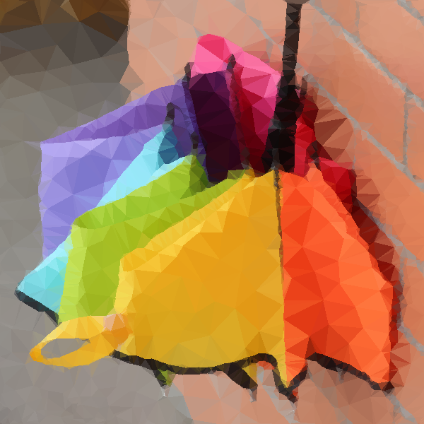

#A Python Low-poly Genrater

##Usage

  python low_poly.py raw\_pic a b [processed\_pic]

Where `a` and `b` stands for parameters for the script. Specifically, `a` stands for `min_distance` used in generating Poisson sampling and `b` stands for the `factor` used for edge detecting.

##Samples

Raw picture (`samples/raw/a.jpg`)

Processed picture (`samples/processed/a.jpg`)

Command line

  python low_poly.py samples/raw/a.jpg 60 3 samples/processed/a.jpg

---

Raw picture (`samples/raw/b.jpg`)

Processed picture (`samples/processed/b.jpg`)

Command line

  python low_poly.py samples/raw/b.jpg 60 3.5 samples/processed/b.jpg

---

Raw picture (`samples/raw/c.png`)

Processed picture (`samples/processed/c.png`)

Command line

  python low_poly.py samples/raw/c.png 30 2 samples/processed/c.png

---

Raw picture (`samples/raw/d.jpg`)

Processed picture (`samples/processed/d.jpg`)

Command line

  python low_poly.py samples/raw/d.jpg 50 1 samples/processed/d.jpg

---
